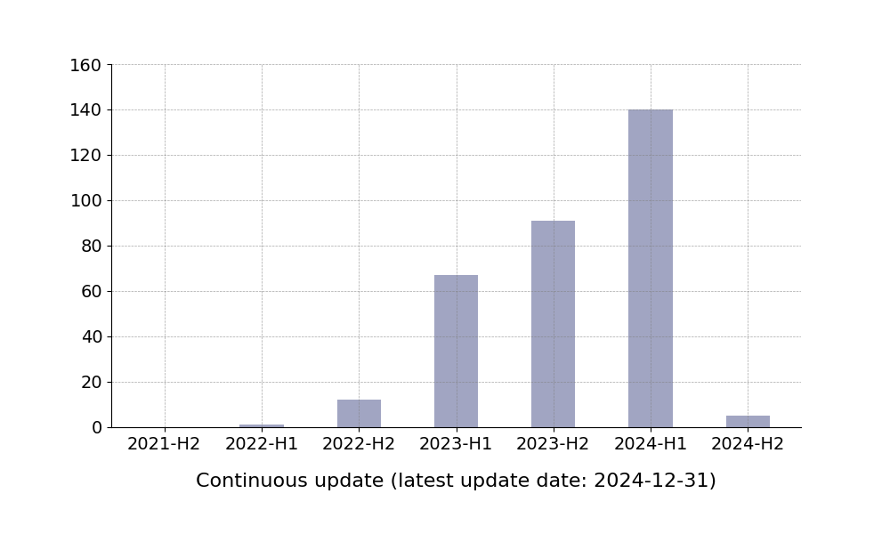

 <!-- # <p align=center>`awesome gan-inversion`</p> -->
[](https://github.com/sindresorhus/awesome)
[](https://GitHub.com/Naereen/StrapDown.js/graphs/commit-activity)
[](http://makeapullrequest.com) 
[](https://arxiv.org/abs/2403.04279) 

<br />
<p align="center">
  <h1 align="center">Awesome Controllable T2I Diffusion Models</h1>
</p>
<br />

We are focusing on how to **Control** text-to-image diffusion models with **Novel Conditions**. 

For more detailed information, please refer to our survey paper: [Controllable Generation with Text-to-Image Diffusion Models: A Survey](https://arxiv.org/abs/2403.04279)

<p align="center">
  
  
</p>


## 💖 Citation
**If you find value in our survey paper or curated collection, please consider citing our work and starring our repo to support us.**

```text
@article{cao2024controllable,
  title={Controllable Generation with Text-to-Image Diffusion Models: A Survey},
  author={Pu Cao and Feng Zhou and Qing Song and Lu Yang},
  journal={arXiv preprint arXiv:2403.04279},
  year={2024}
}
```

## 🎁 How to contribute to this repository?
Since the following content is generated based on our database, please provide the following information in the **issue** to help us fill in the database to add new papers (please do not submit a PR directly).
```text
1. Paper title
2. arXiv ID (if any)
3. Publication status (if any)
```

## 🌈 Contents

- [Generation with Specific Condition](#Generation-with-Specific-Condition)
  - [Personalization](#Personalization)
    - [Subject-Driven Generation](#Subject-Driven-Generation)
    - [Person-Driven Generation](#Person-Driven-Generation)
    - [Style-Driven Generation](#Style-Driven-Generation)
    - [Interaction-Driven Generation](#Interaction-Driven-Generation)
    - [Image-Driven Generation](#Image-Driven-Generation)
    - [Distribution-Driven Generation](#Distribution-Driven-Generation)
  - [Spatial Control](#Spatial-Control)
  - [Advanced Text-Conditioned Generation](#Advanced-Text-Conditioned-Generation)
  - [In-Context Generation](#In-Context-Generation)
  - [Brain-Guided Generation](#Brain-Guided-Generation)
  - [Sound-Guided Generation](#Sound-Guided-Generation)
  - [Text Rendering](#Text-Rendering)
- [Generation with Multiple Conditions](#Generation-with-Multiple-Conditions)
  - [Joint Training](#Joint-Training)
  - [Continual Learning](#Continual-Learning)
  - [Weight Fusion](#Weight-Fusion)
  - [Attention-based Integration](#Attention-based-Integration)
  - [Guidance Composition](#Guidance-Composition)
- [Universal Controllable Generation](#Universal-Controllable-Generation)
  - [Universal Conditional Score Prediction](#Universal-Conditional-Score-Prediction)
  - [Universal Condition-Guided Score Estimation](#Universal-Condition-Guided-Score-Estimation)


<!-- start -->

## 🚀Generation with Specific Condition
### 🍇Personalization
#### 🍉Subject-Driven Generation
**CAT: Contrastive Adapter Training for Personalized Image Generation.**<br>
*Jae Wan Park, Sang Hyun Park, Jun Young Koh, Junha Lee, Min Song.*<br>
arXiv 2024. [[PDF](https://arxiv.org/abs/2404.07554)]

**MoMA: Multimodal LLM Adapter for Fast Personalized Image Generation.**<br>
*Kunpeng Song, Yizhe Zhu, Bingchen Liu, Qing Yan, Ahmed Elgammal, Xiao Yang.*<br>
arXiv 2024. [[PDF](https://arxiv.org/abs/2404.05674)]

**U-VAP: User-specified Visual Appearance Personalization via Decoupled Self Augmentation.**<br>
*You Wu, Kean Liu, Xiaoyue Mi, Fan Tang, Juan Cao, Jintao Li.*<br>
arXiv 2024. [[PDF](https://arxiv.org/abs/2403.20231)]

**Automated Black-box Prompt Engineering for Personalized Text-to-Image Generation.**<br>
*Yutong He, Alexander Robey, Naoki Murata, Yiding Jiang, Joshua Williams, George J. Pappas, Hamed Hassani, Yuki Mitsufuji, Ruslan Salakhutdinov, J. Zico Kolter.*<br>
arXiv 2024. [[PDF](https://arxiv.org/abs/2403.19103)]

**Attention Calibration for Disentangled Text-to-Image Personalization.**<br>
*Yanbing Zhang, Mengping Yang, Qin Zhou, Zhe Wang.*<br>
arXiv 2024. [[PDF](https://arxiv.org/abs/2403.18551)]

**Selectively Informative Description can Reduce Undesired Embedding Entanglements in Text-to-Image Personalization.**<br>
*Jimyeong Kim, Jungwon Park, Wonjong Rhee.*<br>
arXiv 2024. [[PDF](https://arxiv.org/abs/2403.15330)]

**MM-Diff: High-Fidelity Image Personalization via Multi-Modal Condition Integration.**<br>
*Zhichao Wei, Qingkun Su, Long Qin, Weizhi Wang.*<br>
arXiv 2024. [[PDF](https://arxiv.org/abs/2403.15059)]

**Generative Active Learning for Image Synthesis Personalization.**<br>
*Xulu Zhang, Wengyu Zhang, Xiao-Yong Wei, Jinlin Wu, Zhaoxiang Zhang, Zhen Lei, Qing Li.*<br>
arXiv 2024. [[PDF](https://arxiv.org/abs/2403.14987)]

**Harmonizing Visual and Textual Embeddings for Zero-Shot Text-to-Image Customization.**<br>
*Yeji Song, Jimyeong Kim, Wonhark Park, Wonsik Shin, Wonjong Rhee, Nojun Kwak.*<br>
arXiv 2024. [[PDF](https://arxiv.org/abs/2403.14155)]

**Tuning-Free Image Customization with Image and Text Guidance.**<br>
*Pengzhi Li, Qiang Nie, Ying Chen, Xi Jiang, Kai Wu, Yuhuan Lin, Yong Liu, Jinlong Peng, Chengjie Wang, Feng Zheng.*<br>
arXiv 2024. [[PDF](https://arxiv.org/abs/2403.12658)]

**Fast Personalized Text-to-Image Syntheses With Attention Injection.**<br>
*Yuxuan Zhang, Yiren Song, Jinpeng Yu, Han Pan, Zhongliang Jing.*<br>
arXiv 2024. [[PDF](https://arxiv.org/abs/2403.11284)]

**OMG: Occlusion-friendly Personalized Multi-concept Generation in Diffusion Models.**<br>
*Zhe Kong, Yong Zhang, Tianyu Yang, Tao Wang, Kaihao Zhang, Bizhu Wu, Guanying Chen, Wei Liu, Wenhan Luo.*<br>
arXiv 2024. [[PDF](https://arxiv.org/abs/2403.10983)]

**StableGarment: Garment-Centric Generation via Stable Diffusion.**<br>
*Rui Wang, Hailong Guo, Jiaming Liu, Huaxia Li, Haibo Zhao, Xu Tang, Yao Hu, Hao Tang, Peipei Li.*<br>
arXiv 2024. [[PDF](https://arxiv.org/abs/2403.10783)]

**Block-wise LoRA: Revisiting Fine-grained LoRA for Effective Personalization and Stylization in Text-to-Image Generation.**<br>
*Likun Li, Haoqi Zeng, Changpeng Yang, Haozhe Jia, Di Xu.*<br>
arXiv 2024. [[PDF](https://arxiv.org/abs/2403.07500)]

**FaceChain-SuDe: Building Derived Class to Inherit Category Attributes for One-shot Subject-Driven Generation.**<br>
*Pengchong Qiao, Lei Shang, Chang Liu, Baigui Sun, Xiangyang Ji, Jie Chen.*<br>
arXiv 2024. [[PDF](https://arxiv.org/abs/2403.06775)]

**RealCustom: Narrowing Real Text Word for Real-Time Open-Domain Text-to-Image Customization.**<br>
*Mengqi Huang, Zhendong Mao, Mingcong Liu, Qian He, Yongdong Zhang.*<br>
arXiv 2024. [[PDF](https://arxiv.org/abs/2403.00483)]

**DiffuseKronA: A Parameter Efficient Fine-tuning Method for Personalized Diffusion Models.**<br>
*Shyam Marjit, Harshit Singh, Nityanand Mathur, Sayak Paul, Chia-Mu Yu, Pin-Yu Chen.*<br>
arXiv 2024. [[PDF](https://arxiv.org/abs/2402.17412)]

**Direct Consistency Optimization for Compositional Text-to-Image Personalization.**<br>
*Kyungmin Lee, Sangkyung Kwak, Kihyuk Sohn, Jinwoo Shin.*<br>
arXiv 2024. [[PDF](https://arxiv.org/abs/2402.12004)]

**ComFusion: Personalized Subject Generation in Multiple Specific Scenes From Single Image.**<br>
*Yan Hong, Jianfu Zhang.*<br>
arXiv 2024. [[PDF](https://arxiv.org/abs/2402.11849)]

**Visual Concept-driven Image Generation with Text-to-Image Diffusion Model.**<br>
*Tanzila Rahman, Shweta Mahajan, Hsin-Ying Lee, Jian Ren, Sergey Tulyakov, Leonid Sigal.*<br>
arXiv 2024. [[PDF](https://arxiv.org/abs/2402.11487)]

**Textual Localization: Decomposing Multi-concept Images for Subject-Driven Text-to-Image Generation.**<br>
*Junjie Shentu, Matthew Watson, Noura Al Moubayed.*<br>
arXiv 2024. [[PDF](https://arxiv.org/abs/2402.09966)]

**DreamMatcher: Appearance Matching Self-Attention for Semantically-Consistent Text-to-Image Personalization.**<br>
*Jisu Nam, Heesu Kim, DongJae Lee, Siyoon Jin, Seungryong Kim, Seunggyu Chang.*<br>
CVPR 2024. [[PDF](https://arxiv.org/abs/2402.09812)]

**SeFi-IDE: Semantic-Fidelity Identity Embedding for Personalized Diffusion-Based Generation.**<br>
*Yang Li, Songlin Yang, Wei Wang, Jing Dong.*<br>
arXiv 2024. [[PDF](https://arxiv.org/abs/2402.00631)]

**Pick-and-Draw: Training-free Semantic Guidance for Text-to-Image Personalization.**<br>
*Henglei Lv, Jiayu Xiao, Liang Li, Qingming Huang.*<br>
arXiv 2024. [[PDF](https://arxiv.org/abs/2401.16762)]

**Object-Driven One-Shot Fine-tuning of Text-to-Image Diffusion with Prototypical Embedding.**<br>
*Jianxiang Lu, Cong Xie, Hui Guo.*<br>
arXiv 2024. [[PDF](https://arxiv.org/abs/2401.15708)]

**BootPIG: Bootstrapping Zero-shot Personalized Image Generation Capabilities in Pretrained Diffusion Models.**<br>
*Senthil Purushwalkam, Akash Gokul, Shafiq Joty, Nikhil Naik.*<br>
arXiv 2024. [[PDF](https://arxiv.org/abs/2401.13974)]

**PALP: Prompt Aligned Personalization of Text-to-Image Models.**<br>
*Moab Arar, Andrey Voynov, Amir Hertz, Omri Avrahami, Shlomi Fruchter, Yael Pritch, Daniel Cohen-Or, Ariel Shamir.*<br>
arXiv 2024. [[PDF](https://arxiv.org/abs/2401.06105)]

**Cross Initialization for Personalized Text-to-Image Generation.**<br>
*Lianyu Pang, Jian Yin, Haoran Xie, Qiping Wang, Qing Li, Xudong Mao.*<br>
CVPR 2024. [[PDF](https://arxiv.org/abs/2312.15905)]

**DreamTuner: Single Image is Enough for Subject-Driven Generation.**<br>
*Miao Hua, Jiawei Liu, Fei Ding, Wei Liu, Jie Wu, Qian He.*<br>
arXiv 2023. [[PDF](https://arxiv.org/abs/2312.13691)]

**Decoupled Textual Embeddings for Customized Image Generation.**<br>
*Yufei Cai, Yuxiang Wei, Zhilong Ji, Jinfeng Bai, Hu Han, Wangmeng Zuo.*<br>
arXiv 2023. [[PDF](https://arxiv.org/abs/2312.11826)]

**Compositional Inversion for Stable Diffusion Models.**<br>
*Xulu Zhang, Xiao-Yong Wei, Jinlin Wu, Tianyi Zhang, Zhaoxiang Zhang, Zhen Lei, Qing Li.*<br>
AAAI 2024. [[PDF](https://arxiv.org/abs/2312.08048v3)]

**Customization Assistant for Text-to-image Generation.**<br>
*Yufan Zhou, Ruiyi Zhang, Jiuxiang Gu, Tong Sun.*<br>
CVPR 2024. [[PDF](https://arxiv.org/abs/2312.03045)]

**VideoBooth: Diffusion-based Video Generation with Image Prompts.**<br>
*Yuming Jiang, Tianxing Wu, Shuai Yang, Chenyang Si, Dahua Lin, Yu Qiao, Chen Change Loy, Ziwei Liu.*<br>
arXiv 2023. [[PDF](https://arxiv.org/abs/2312.00777)]

**HiFi Tuner: High-Fidelity Subject-Driven Fine-Tuning for Diffusion Models.**<br>
*Zhonghao Wang, Wei Wei, Yang Zhao, Zhisheng Xiao, Mark Hasegawa-Johnson, Humphrey Shi, Tingbo Hou.*<br>
arXiv 2023. [[PDF](https://arxiv.org/abs/2312.00079)]

**VideoAssembler: Identity-Consistent Video Generation with Reference Entities using Diffusion Model.**<br>
*Haoyu Zhao, Tianyi Lu, Jiaxi Gu, Xing Zhang, Zuxuan Wu, Hang Xu, Yu-Gang Jiang.*<br>
arXiv 2023. [[PDF](https://arxiv.org/abs/2311.17338)]

**CLiC: Concept Learning in Context.**<br>
*Mehdi Safaee, Aryan Mikaeili, Or Patashnik, Daniel Cohen-Or, Ali Mahdavi-Amiri.*<br>
CVPR 2024. [[PDF](https://arxiv.org/abs/2311.17083)]

**CatVersion- Concatenating Embeddings for Diffusion-Based Text-to-Image Personalization.**<br>
*Ruoyu Zhao, Mingrui Zhu, Shiyin Dong, Nannan Wang, Xinbo Gao.*<br>
arXiv 2023. [[PDF](https://arxiv.org/abs/2311.14631)]

**Lego- Learning to Disentangle and Invert Concepts Beyond Object Appearance in Text-to-Image Diffusion Models.**<br>
*Saman Motamed, Danda Pani Paudel, Luc Van Gool.*<br>
arXiv 2023. [[PDF](https://arxiv.org/abs/2311.13833)]

**An Image is Worth Multiple Words- Multi-attribute Inversion for Constrained Text-to-Image Synthesis.**<br>
*Aishwarya Agarwal, Srikrishna Karanam, Tripti Shukla, Balaji Vasan Srinivasan.*<br>
arXiv 2023. [[PDF](https://arxiv.org/abs/2311.11919)]

**DIFFNAT- Improving Diffusion Image Quality Using Natural Image  Statistics.**<br>
*Aniket Roy, Maiterya Suin, Anshul Shah, Ketul Shah, Jiang Liu, Rama Chellappa.*<br>
arXiv 2023. [[PDF](https://arxiv.org/abs/2311.09753)]

**A Data Perspective on Enhanced Identity Preservation for Diffusion  Personalization.**<br>
*Xingzhe He, Zhiwen Cao, Nicholas Kolkin, Lantao Yu, Helge Rhodin, Ratheesh Kalarot.*<br>
arXiv 2023. [[PDF](https://arxiv.org/abs/2311.04315)]

**AN IMAGE IS WORTH MULTIPLE WORDS : LEARNING OBJECT LEVEL CONCEPTS USING MULTI-CONCEPT PROMPT LEARNING.**<br>
*Chen Jin, Ryutaro Tanno, Amrutha Saseendran, Tom Diethe, Philip Teare.*<br>
arXiv 2023. [[PDF](https://arxiv.org/abs/2310.12274)]

**Kosmos-G: Generating Images in Context with Multimodal Large Language Models.**<br>
*Xichen Pan, Li Dong, Shaohan Huang, Zhiliang Peng, Wenhu Chen, Furu Wei.*<br>
arXiv 2023. [[PDF](https://arxiv.org/abs/2310.02992)]

**Navigating Text-To-Image Customization: From LyCORIS Fine-Tuning to Model Evaluation.**<br>
*Shin-Ying Yeh, Yu-Guan Hsieh, Zhidong Gao, Bernard B W Yang, Giyeong Oh, Yanmin Gong.*<br>
ICLR 2024. [[PDF](https://arxiv.org/abs/2309.14859)]

**Subject-Diffusion- Open Domain Personalized  Text-to-Image Generation without Test-time  Fine-tuning.**<br>
*Jian Ma, Junhao Liang, Chen Chen, Haonan Lu.*<br>
ICLR2024 (3566). [[PDF](https://arxiv.org/abs/2307.11410)]

**Domain-Agnostic Tuning-Encoder for Fast Personalization of  Text-To-Image Models .**<br>
*Moab Arar, Rinon Gal, Yuval Atzmon, Gal Chechik, Daniel Cohen-Or, Ariel Shamir, Amit H. Bermano.*<br>
SIGGRAPH ASIA 2023. [[PDF](https://arxiv.org/abs/2307.06925)]

**Generate Anything Anywhere in Any Scene.**<br>
*Yuheng Li, Haotian Liu, Yangming Wen, Yong Jae Lee.*<br>
arXiv 2023. [[PDF](https://arxiv.org/abs/2306.17154)]

**Controlling Text-to-Image Diffusion by Orthogonal Finetuning .**<br>
*Zeju Qiu, Weiyang Liu, Haiwen Feng, Yuxuan Xue, Yao Feng, Zhen Liu, Dan Zhang, Adrian Weller, Bernhard Schölkopf.*<br>
NeurIPS 2023. [[PDF](https://arxiv.org/abs/2306.07280)]

**COMCAT: Towards Efficient Compression and Customization of
Attention-Based Vision Models.**<br>
*Jinqi Xiao, Miao Yin, Yu Gong, Xiao Zang, Jian Ren, Bo Yuan.*<br>
arXiv 2023. [[PDF](https://arxiv.org/abs/2305.17235)]

**Break-A-Scene: Extracting Multiple Concepts from a Single Image.**<br>
*Omri Avrahami, Kfir Aberman, Ohad Fried, Daniel Cohen-Or, Dani Lischinski.*<br>
SIGGRAPH ASIA 2023. [[PDF](https://arxiv.org/abs/2305.16311)]

**ProSpect- Prompt Spectrum for Attribute-Aware Personalization of  Diffusion Models.**<br>
*Yuxin Zhang, Weiming Dong, Fan Tang, Nisha Huang, Haibin Huang, Chongyang Ma, Tong-Yee Lee, Oliver Deussen, Changsheng Xu.*<br>
TOG 2023. [[PDF](https://arxiv.org/abs/2305.16225)]

**BLIP-Diffusion- Pre-trained Subject Representation for  Controllable Text-to-Image Generation and Editing.**<br>
*Dongxu Li, Junnan Li, Steven C. H. Hoi.*<br>
NeurIPS 2023. [[PDF](https://arxiv.org/abs/2305.14720)]

**DisenBooth- Disentangled Parameter-Efficient Tuning for Subject-Driven  Text-to-Image Generation.**<br>
*Hong Chen, Yipeng Zhang, Simin Wu, Xin Wang, Xuguang Duan, Yuwei Zhou, Wenwu Zhu.*<br>
arXiv 2023. [[PDF](https://arxiv.org/abs/2305.03374)]

**Key-Locked Rank One Editing for Text-to-Image Personalization.**<br>
*Yoad Tewel, Rinon Gal, Gal Chechik, Yuval Atzmon.*<br>
SIGGRAPH 2023. [[PDF](https://arxiv.org/abs/2305.01644)]

**Gradient-Free Textual Inversion.**<br>
*Zhengcong Fei, Mingyuan Fan, Junshi Huang.*<br>
ACM MM 2023. [[PDF](https://arxiv.org/abs/2304.05818)]

**Controllable Textual Inversion for Personalized Text-to-Image Generation.**<br>
*Jianan Yang, Haobo Wang, Yanming Zhang, Ruixuan Xiao, Sai Wu, Gang Chen, Junbo Zhao.*<br>
arXiv 2023. [[PDF](https://arxiv.org/abs/2304.05265)]

**InstantBooth- Personalized Text-to-Image Generation without Test-Time  Finetuning.**<br>
*Jing Shi, Wei Xiong, Zhe Lin, Hyun Joon Jung.*<br>
CVPR 2024. [[PDF](https://arxiv.org/abs/2304.03411)]

**Taming Encoder for Zero Fine-tuning Image Customization  with Text-to-Image Diffusion Models.**<br>
*Xuhui Jia, Yang Zhao, Kelvin C. K. Chan, Yandong Li, Han Zhang, Boqing Gong, Tingbo Hou, Huisheng Wang, Yu-Chuan Su.*<br>
arXiv 2023. [[PDF](https://arxiv.org/abs/2304.02642)]

**Subject-driven Text-to-Image Generation via  Apprenticeship Learning.**<br>
*Wenhu Chen, Hexiang Hu, Yandong Li, Nataniel Ruiz, Xuhui Jia, Ming-Wei Chang, William W. Cohen.*<br>
NeurIPS 2023. [[PDF](https://arxiv.org/abs/2304.00186)]

**A Closer Look at Parameter-Efficient Tuning in Diffusion Models .**<br>
*Chendong Xiang, Fan Bao, Chongxuan Li, Hang Su, Jun Zhu.*<br>
arXiv 2023. [[PDF](https://arxiv.org/abs/2303.18181)]

**SVDiff- Compact Parameter Space for Diffusion Fine-Tuning.**<br>
*Ligong Han, Yinxiao Li, Han Zhang, Peyman Milanfar, Dimitris Metaxas, Feng Yang.*<br>
ICCV 2023. [[PDF](https://arxiv.org/abs/2303.11305)]

**P+- Extended Textual Conditioning in Text-to-Image Generation.**<br>
*Andrey Voynov, Qinghao Chu, Daniel Cohen-Or, Kfir Aberman.*<br>
arXiv 2023. [[PDF](https://arxiv.org/abs/2303.09522)]

**Unified Multi-Modal Latent Diffusion for
Joint Subject and Text Conditional Image Generation.**<br>
*Yiyang Ma, Huan Yang, Wenjing Wang, Jianlong Fu, Jiaying Liu.*<br>
arXiv 2023. [[PDF](https://arxiv.org/abs/2303.09319)]

**ELITE- Encoding Visual Concepts into Textual Embeddings  for Customized Text-to-Image Generation.**<br>
*Yuxiang Wei, Yabo Zhang, Zhilong Ji, Jinfeng Bai, Lei Zhang, Wangmeng Zuo.*<br>
ICCV 2023. [[PDF](https://arxiv.org/abs/2302.13848)]

**Designing an Encoder for Fast Personalization of Text-to-Image  Models.**<br>
*Rinon Gal, Moab Arar, Yuval Atzmon, Amit H. Bermano, Gal Chechik, Daniel Cohen-Or.*<br>
arXiv 2023. [[PDF](https://arxiv.org/abs/2302.12228)]

**Is This Loss Informative? Faster Text-to-Image Customization by Tracking Objective Dynamics.**<br>
*Anton Voronov, Mikhail Khoroshikh, Artem Babenko, Max Ryabinin.*<br>
NeurIPS 2023. [[PDF](https://arxiv.org/abs/2302.04841)]

**Multi-Concept Customization of Text-to-Image Diffusion.**<br>
*Nupur Kumari, Bingliang Zhang, Richard Zhang, Eli Shechtman, Jun-Yan Zhu.*<br>
CVPR 2023. [[PDF](https://arxiv.org/abs/2212.04488)]

**DreamArtist: Towards Controllable One-Shot Text-to-Image Generation via Positive-Negative Prompt-Tuning.**<br>
*Ziyi Dong, Pengxu Wei, Liang Lin.*<br>
arXiv 2022. [[PDF](https://arxiv.org/abs/2211.11337)]

**Re-Imagen: Retrieval-Augmented Text-to-Image Generator.**<br>
*Wenhu Chen, Hexiang Hu, Chitwan Saharia, William W. Cohen.*<br>
ICLR 2023. [[PDF](https://arxiv.org/abs/2209.14491)]

**DreamBooth- Fine Tuning Text-to-Image Diffusion Models  for Subject-Driven Generation.**<br>
*Nataniel Ruiz, Yuanzhen Li, Varun Jampani, Yael Pritch, Michael Rubinstein, Kfir Aberman.*<br>
CVPR 2023. [[PDF](https://arxiv.org/abs/2208.12242)]

**An Image is Worth One Word- Personalizing  Text-to-Image Generation using Textual Inversion.**<br>
*Rinon Gal, Yuval Alaluf, Yuval Atzmon, Or Patashnik, Amit H. Bermano, Gal Chechik, Daniel Cohen-Or.*<br>
ICLR 2023. [[PDF](https://arxiv.org/abs/2208.01618)]


#### 🍊Person-Driven Generation
**From Parts to Whole: A Unified Reference Framework for Controllable Human Image Generation.**<br>
*Zehuan Huang, Hongxing Fan, Lipeng Wang, Lu Sheng.*<br>
arXiv 2024. [[PDF](https://arxiv.org/abs/2404.15267)]

**LCM-Lookahead for Encoder-based Text-to-Image Personalization.**<br>
*Rinon Gal, Or Lichter, Elad Richardson, Or Patashnik, Amit H. Bermano, Gal Chechik, Daniel Cohen-Or.*<br>
arXiv 2024. [[PDF](https://arxiv.org/abs/2404.03620)]

**FlashFace: Human Image Personalization with High-fidelity Identity Preservation.**<br>
*Shilong Zhang, Lianghua Huang, Xi Chen, Yifei Zhang, Zhi-Fan Wu, Yutong Feng, Wei Wang, Yujun Shen, Yu Liu, Ping Luo.*<br>
arXiv 2024. [[PDF](https://arxiv.org/abs/2403.17008)]

**IDAdapter: Learning Mixed Features for Tuning-Free Personalization of Text-to-Image Models.**<br>
*Siying Cui, Jia Guo, Xiang An, Jiankang Deng, Yongle Zhao, Xinyu Wei, Ziyong Feng.*<br>
arXiv 2024. [[PDF](https://arxiv.org/abs/2403.13535)]

**Infinite-ID: Identity-preserved Personalization via ID-semantics Decoupling Paradigm.**<br>
*Yi Wu, Ziqiang Li, Heliang Zheng, Chaoyue Wang, Bin Li.*<br>
arXiv 2024. [[PDF](https://arxiv.org/abs/2403.11781)]

**Face2Diffusion for Fast and Editable Face Personalization.**<br>
*Kaede Shiohara, Toshihiko Yamasaki.*<br>
CVPR 2024. [[PDF](https://arxiv.org/abs/2403.05094)]

**CapHuman: Capture Your Moments in Parallel Universes.**<br>
*Chao Liang, Fan Ma, Linchao Zhu, Yingying Deng, Yi Yang.*<br>
arXiv 2024. [[PDF](https://arxiv.org/abs/2402.00627)]

**StableIdentity: Inserting Anybody into Anywhere at First Sight.**<br>
*Qinghe Wang, Xu Jia, Xiaomin Li, Taiqing Li, Liqian Ma, Yunzhi Zhuge, Huchuan Lu.*<br>
arXiv 2024. [[PDF](https://arxiv.org/abs/2401.15975)]

**InstantID: Zero-shot Identity-Preserving Generation in Seconds.**<br>
*Qixun Wang, Xu Bai, Haofan Wang, Zekui Qin, Anthony Chen, Huaxia Li, Xu Tang, Yao Hu.*<br>
arXiv 2024. [[PDF](https://arxiv.org/abs/2401.07519)]

**Towards a Simultaneous and Granular Identity-Expression Control in Personalized Face Generation.**<br>
*Renshuai Liu, Bowen Ma, Wei Zhang, Zhipeng Hu, Changjie Fan, Tangjie Lv, Yu Ding, Xuan Cheng.*<br>
arXiv 2024. [[PDF](https://arxiv.org/abs/2401.01207)]

**PortraitBooth: A Versatile Portrait Model for Fast Identity-preserved Personalization.**<br>
*Xu Peng, Junwei Zhu, Boyuan Jiang, Ying Tai, Donghao Luo, Jiangning Zhang, Wei Lin, Taisong Jin, Chengjie Wang, Rongrong Ji.*<br>
CVPR 2024. [[PDF](https://arxiv.org/abs/2312.06354)]

**Stellar: Systematic Evaluation of Human-Centric Personalized Text-to-Image Methods.**<br>
*Panos Achlioptas, Alexandros Benetatos, Iordanis Fostiropoulos, Dimitris Skourtis.*<br>
arXiv 2023. [[PDF](https://arxiv.org/abs/2312.06116)]

**PhotoMaker: Customizing Realistic Human Photos via Stacked ID Embedding.**<br>
*Zhen Li, Mingdeng Cao, Xintao Wang, Zhongang Qi, Ming-Ming Cheng, Ying Shan.*<br>
arXiv 2023. [[PDF](https://arxiv.org/abs/2312.04461)]

**DemoCaricature: Democratising Caricature Generation with a Rough Sketch.**<br>
*Dar-Yen Chen, Subhadeep Koley, Aneeshan Sain, Pinaki Nath Chowdhury, Tao Xiang, Ayan Kumar Bhunia, Yi-Zhe Song.*<br>
arXiv 2023. [[PDF](https://arxiv.org/abs/2312.04364)]

**ViscoNet: Bridging and Harmonizing Visual and Textual Conditioning for ControlNet.**<br>
*Soon Yau Cheong, Armin Mustafa, Andrew Gilbert.*<br>
arXiv 2023. [[PDF](https://arxiv.org/abs/2312.03154)]

**FaceStudio: Put Your Face Everywhere in Seconds.**<br>
*Yuxuan Yan, Chi Zhang, Rui Wang, Yichao Zhou, Gege Zhang, Pei Cheng, Gang Yu, Bin Fu.*<br>
arXiv 2023. [[PDF](https://arxiv.org/abs/2312.02663)]

**Retrieving Conditions from Reference Images for Diffusion Models.**<br>
*Haoran Tang, Xin Zhou, Jieren Deng, Zhihong Pan, Hao Tian, Pratik Chaudhari.*<br>
arXiv 2023. [[PDF](https://arxiv.org/abs/2312.02521)]

**When StyleGAN Meets Stable Diffusion- a W + Adapter for Personalized Image Generation.**<br>
*Xiaoming Li, Xinyu Hou, Chen Change Loy.*<br>
arXiv 2023. [[PDF](https://arxiv.org/abs/2311.17461)]

**High-fidelity Person-centric Subject-to-Image Synthesis.**<br>
*Yibin Wang, Weizhong Zhang, Jianwei Zheng, Cheng Jin.*<br>
arXiv 2023. [[PDF](https://arxiv.org/abs/2311.10329)]

**MagiCapture- High-Resolution Multi-Concept Portrait Customization.**<br>
*Junha Hyung, Jaeyo Shin, Jaegul Choo.*<br>
arXiv 2023. [[PDF](https://arxiv.org/abs/2309.06895)]

**PhotoVerse- Tuning-Free Image Customization with Text-to-Image Diffusion Models.**<br>
*Li Chen, Mengyi Zhao, Yiheng Liu, Mingxu Ding, Yangyang Song, Shizun Wang, Xu Wang, Hao Yang, Jing Liu, Kang Du, Min Zheng.*<br>
arXiv 2023. [[PDF](https://arxiv.org/abs/2309.05793)]

**HyperDreamBooth- HyperNetworks for Fast  Personalization of Text-to-Image Models .**<br>
*Nataniel Ruiz, Yuanzhen Li, Varun Jampani, Wei Wei, Tingbo Hou, Yael Pritch, Neal Wadhwa, Michael Rubinstein, Kfir Aberman.*<br>
CVPR 2024. [[PDF](https://arxiv.org/abs/2307.06949)]

**DreamIdentity- Improved Editability for Efficient  Face-identity Preserved Image Generation .**<br>
*Zhuowei Chen, Shancheng Fang, Wei Liu, Qian He, Mengqi Huang, Yongdong Zhang, Zhendong Mao.*<br>
arXiv 2023. [[PDF](https://arxiv.org/abs/2307.00300)]

**Face0- Instantaneously Conditioning a Text-to-Image Model on a Face.**<br>
*Dani Valevski, Danny Wasserman, Yossi Matias, Yaniv Leviathan.*<br>
arXiv 2023. [[PDF](https://arxiv.org/abs/2306.06638)]

**Conditioning Diffusion Models via Attributes and Semantic Masks for Face Generation.**<br>
*Nico Giambi, Giuseppe Lisanti.*<br>
arXiv 2023. [[PDF](https://arxiv.org/abs/2306.00914)]

**FastComposer: Tuning-Free Multi-Subject Image Generation with Localized Attention.**<br>
*Guangxuan Xiao, Tianwei Yin, William T. Freeman, Frédo Durand, Song Han.*<br>
arXiv 2023. [[PDF](https://arxiv.org/abs/2305.10431)]


#### 🍋Style-Driven Generation
**Text-to-Image Synthesis for Any Artistic Styles: Advancements in Personalized Artistic Image Generation via Subdivision and Dual Binding.**<br>
*Junseo Park, Beomseok Ko, Hyeryung Jang.*<br>
arXiv 2024. [[PDF](https://arxiv.org/abs/2404.05256)]

**InstantStyle: Free Lunch towards Style-Preserving in Text-to-Image Generation.**<br>
*Haofan Wang, Matteo Spinelli, Qixun Wang, Xu Bai, Zekui Qin, Anthony Chen.*<br>
arXiv 2024. [[PDF](https://arxiv.org/abs/2404.02733)]

**Implicit Style-Content Separation using B-LoRA.**<br>
*Yarden Frenkel, Yael Vinker, Ariel Shamir, Daniel Cohen-Or.*<br>
arXiv 2024. [[PDF](https://arxiv.org/abs/2403.14572)]

**DEADiff: An Efficient Stylization Diffusion Model with Disentangled Representations.**<br>
*Tianhao Qi, Shancheng Fang, Yanze Wu, Hongtao Xie, Jiawei Liu, Lang Chen, Qian He, Yongdong Zhang.*<br>
CVPR 2024. [[PDF](https://arxiv.org/abs/2403.06951)]

**Visual Style Prompting with Swapping Self-Attention.**<br>
*Jaeseok Jeong, Junho Kim, Yunjey Choi, Gayoung Lee, Youngjung Uh.*<br>
arXiv 2024. [[PDF](https://arxiv.org/abs/2402.12974)]

**Towards Accurate Guided Diffusion Sampling through Symplectic Adjoint Method.**<br>
*Jiachun Pan, Hanshu Yan, Jun Hao Liew, Jiashi Feng, Vincent Y. F. Tan.*<br>
arXiv 2023. [[PDF](https://arxiv.org/abs/2312.12030)]

**Style Aligned Image Generation via Shared Attention.**<br>
*Amir Hertz, Andrey Voynov, Shlomi Fruchter, Daniel Cohen-Or.*<br>
CVPR 2024. [[PDF](https://arxiv.org/abs/2312.02133)]

**ArtAdapter: Text-to-Image Style Transfer using Multi-Level Style Encoder and Explicit Adaptation.**<br>
*Dar-Yen Chen, Hamish Tennent, Ching-Wen Hsu.*<br>
arXiv 2023. [[PDF](https://arxiv.org/abs/2312.02109)]

**StyleCrafter- Enhancing Stylized Text-to-Video Generation with Style Adapter.**<br>
*Gongye Liu, Menghan Xia, Yong Zhang, Haoxin Chen, Jinbo Xing, Xintao Wang, Yujiu Yang, Ying Shan.*<br>
arXiv 2023. [[PDF](https://arxiv.org/abs/2312.00330)]

**StyleDrop: Text-to-Image Generation in Any Style.**<br>
*Kihyuk Sohn, Nataniel Ruiz, Kimin Lee, Daniel Castro Chin, Irina Blok, Huiwen Chang, Jarred Barber, Lu Jiang, Glenn Entis, Yuanzhen Li, Yuan Hao, Irfan Essa, Michael Rubinstein, Dilip Krishnan.*<br>
arXiv 2023. [[PDF](https://arxiv.org/abs/2306.00983)]


#### 🍍Interaction-Driven Generation 
**InteractDiffusion: Interaction Control in Text-to-Image Diffusion Models.**<br>
*Jiun Tian Hoe, Xudong Jiang, Chee Seng Chan, Yap-Peng Tan, Weipeng Hu.*<br>
arXiv 2023. [[PDF](https://arxiv.org/abs/2312.05849)]

**MotionCrafter: One-Shot Motion Customization of Diffusion Models.**<br>
*Yuxin Zhang, Fan Tang, Nisha Huang, Haibin Huang, Chongyang Ma, Weiming Dong, Changsheng Xu.*<br>
arXiv 2023. [[PDF](https://arxiv.org/abs/2312.05288)]

**DreaMoving: A Human Dance Video Generation Framework based on Diffusion Models.**<br>
*Mengyang Feng, Jinlin Liu, Kai Yu, Yuan Yao, Zheng Hui, Xiefan Guo, Xianhui Lin, Haolan Xue, Chen Shi, Xiaowen Li, Aojie Li, Xiaoyang Kang, Biwen Lei, Miaomiao Cui, Peiran Ren, Xuansong Xie.*<br>
arXiv 2023. [[PDF](https://arxiv.org/abs/2312.05107)]

**Customizing Motion in Text-to-Video Diffusion Models.**<br>
*Joanna Materzynska, Josef Sivic, Eli Shechtman, Antonio Torralba, Richard Zhang, Bryan Russell.*<br>
arXiv 2023. [[PDF](https://arxiv.org/abs/2312.04966)]

**SAVE: Protagonist Diversification with Structure Agnostic Video Editing.**<br>
*Yeji Song, Wonsik Shin, Junsoo Lee, Jeesoo Kim, Nojun Kwak.*<br>
arXiv 2023. [[PDF](https://arxiv.org/abs/2312.02503)]

**LAMP: Learn A Motion Pattern for Few-Shot-Based Video Generation.**<br>
*Ruiqi Wu, Liangyu Chen, Tong Yang, Chunle Guo, Chongyi Li, Xiangyu Zhang.*<br>
arXiv 2023. [[PDF](https://arxiv.org/abs/2310.10769)]

**MotionDirector- Motion Customization of Text-to-Video Diffusion Models.**<br>
*Rui Zhao, Yuchao Gu, Jay Zhangjie Wu, David Junhao Zhang, Jiawei Liu, Weijia Wu, Jussi Keppo, Mike Zheng Shou.*<br>
arXiv 2023. [[PDF](https://arxiv.org/abs/2310.08465)]

**AnimateDiff- Animate Your Personalized Text-to-Image Diffusion Models  without Specific Tuning.**<br>
*Yuwei Guo, Ceyuan Yang, Anyi Rao, Zhengyang Liang, Yaohui Wang, Yu Qiao, Maneesh Agrawala, Dahua Lin, Bo Dai.*<br>
ICLR2024 (6688). [[PDF](https://arxiv.org/abs/2307.04725)]

**ReVersion- Diffusion-Based Relation Inversion from Images .**<br>
*Ziqi Huang, Tianxing Wu, Yuming Jiang, Kelvin C. K. Chan, Ziwei Liu.*<br>
arXiv 2023. [[PDF](https://arxiv.org/abs/2303.13495)]


#### 🍎Image-Driven Generation
**FreeControl: Training-Free Spatial Control of Any Text-to-Image Diffusion Model with Any Condition.**<br>
*Sicheng Mo, Fangzhou Mu, Kuan Heng Lin, Yanli Liu, Bochen Guan, Yin Li, Bolei Zhou.*<br>
arXiv 2023. [[PDF](https://arxiv.org/abs/2312.07536)]

**Context Diffusion: In-Context Aware Image Generation.**<br>
*Ivona Najdenkoska, Animesh Sinha, Abhimanyu Dubey, Dhruv Mahajan, Vignesh Ramanathan, Filip Radenovic.*<br>
arXiv 2023. [[PDF](https://arxiv.org/abs/2312.03584)]

**ViscoNet: Bridging and Harmonizing Visual and Textual Conditioning for ControlNet.**<br>
*Soon Yau Cheong, Armin Mustafa, Andrew Gilbert.*<br>
arXiv 2023. [[PDF](https://arxiv.org/abs/2312.03154)]

**IP-Adapter: Text Compatible Image Prompt Adapter for Text-to-Image Diffusion Models.**<br>
*Hu Ye, Jun Zhang, Sibo Liu, Xiao Han, Wei Yang.*<br>
arXiv 2023. [[PDF](https://arxiv.org/abs/2308.06721)]

**Uni-ControlNet: All-in-One Control to Text-to-Image Diffusion Models.**<br>
*Shihao Zhao, Dongdong Chen, Yen-Chun Chen, Jianmin Bao, Shaozhe Hao, Lu Yuan, Kwan-Yee K. Wong.*<br>
NeurIPS 2023. [[PDF](https://arxiv.org/abs/2305.16322)]

**Prompt-Free Diffusion: Taking “Text” out of Text-to-Image Diffusion Models.**<br>
*Xingqian Xu, Jiayi Guo, Zhangyang Wang, Gao Huang, Irfan Essa, Humphrey Shi.*<br>
arXiv 2023. [[PDF](https://arxiv.org/abs/2305.16223)]

**Versatile Diffusion: Text, Images and Variations All in One Diffusion Model.**<br>
*Xingqian Xu, Zhangyang Wang, Eric Zhang, Kai Wang, Humphrey Shi.*<br>
ICCV 2023. [[PDF](https://arxiv.org/abs/2211.08332)]

**Hierarchical Text-Conditional Image Generation with CLIP Latents.**<br>
*Aditya Ramesh, Prafulla Dhariwal, Alex Nichol, Casey Chu, Mark Chen.*<br>
arXiv 2022. [[PDF](https://arxiv.org/abs/2204.06125)]


#### 🍐Distribution-Driven Generation
**DreamDistribution: Prompt Distribution Learning for Text-to-Image Diffusion Models.**<br>
*Brian Nlong Zhao, Yuhang Xiao, Jiashu Xu, Xinyang Jiang, Yifan Yang, Dongsheng Li, Laurent Itti, Vibhav Vineet, Yunhao Ge.*<br>
arXiv 2023. [[PDF](https://arxiv.org/abs/2312.14216)]

**Concept-centric Personalization with Large-scale Diffusion Priors.**<br>
*Pu Cao, Lu Yang, Feng Zhou, Tianrui Huang, Qing Song.*<br>
arXiv 2023. [[PDF](https://arxiv.org/abs/2312.08195)]


### 🍔Spatial Control
**ControlNet++: Improving Conditional Controls with Efficient Consistency Feedback.**<br>
*Ming Li, Taojiannan Yang, Huafeng Kuang, Jie Wu, Zhaoning Wang, Xuefeng Xiao, Chen Chen.*<br>
arXiv 2024. [[PDF](https://arxiv.org/abs/2404.07987)]

**ObjBlur: A Curriculum Learning Approach With Progressive Object-Level Blurring for Improved Layout-to-Image Generation.**<br>
*Stanislav Frolov, Brian B. Moser, Sebastian Palacio, Andreas Dengel.*<br>
arXiv 2024. [[PDF](https://arxiv.org/abs/2404.07564)]

**SmartControl: Enhancing ControlNet for Handling Rough Visual Conditions.**<br>
*Xiaoyu Liu, Yuxiang Wei, Ming Liu, Xianhui Lin, Peiran Ren, Xuansong Xie, Wangmeng Zuo.*<br>
arXiv 2024. [[PDF](https://arxiv.org/abs/2404.06451)]

**U-Sketch: An Efficient Approach for Sketch to Image Diffusion Models.**<br>
*Ilias Mitsouras, Eleftherios Tsonis, Paraskevi Tzouveli, Athanasios Voulodimos.*<br>
arXiv 2024. [[PDF](https://arxiv.org/abs/2403.18425)]

**ECNet: Effective Controllable Text-to-Image Diffusion Models.**<br>
*Sicheng Li, Keqiang Sun, Zhixin Lai, Xiaoshi Wu, Feng Qiu, Haoran Xie, Kazunori Miyata, Hongsheng Li.*<br>
arXiv 2024. [[PDF](https://arxiv.org/abs/2403.18417)]

**Be Yourself: Bounded Attention for Multi-Subject Text-to-Image Generation.**<br>
*Omer Dahary, Or Patashnik, Kfir Aberman, Daniel Cohen-Or.*<br>
arXiv 2024. [[PDF](https://arxiv.org/abs/2403.16990)]

**Diffusion-based Aesthetic QR Code Generation via Scanning-Robust Perceptual Guidance.**<br>
*Jia-Wei Liao, Winston Wang, Tzu-Sian Wang, Li-Xuan Peng, Cheng-Fu Chou, Jun-Cheng Chen.*<br>
arXiv 2024. [[PDF](https://arxiv.org/abs/2403.15878)]

**ReGround: Improving Textual and Spatial Grounding at No Cost.**<br>
*Yuseung Lee, Minhyuk Sung.*<br>
arXiv 2024. [[PDF](https://arxiv.org/abs/2403.13589)]

**DetDiffusion: Synergizing Generative and Perceptive Models for Enhanced Data Generation and Perception.**<br>
*Yibo Wang, Ruiyuan Gao, Kai Chen, Kaiqiang Zhou, Yingjie Cai, Lanqing Hong, Zhenguo Li, Lihui Jiang, Dit-Yan Yeung, Qiang Xu, Kai Zhang.*<br>
arXiv 2024. [[PDF](https://arxiv.org/abs/2403.13304)]

**Consistency Models Improve Diffusion Inverse Solvers.**<br>
*Tongda Xu, Ziran Zhu, Dailan He, Yuanyuan Wang, Ming Sun, Ning Li, Hongwei Qin, Yan Wang, Jingjing Liu, Ya-Qin Zhang.*<br>
arXiv 2024. [[PDF](https://arxiv.org/abs/2403.12063)]

**One-Step Image Translation with Text-to-Image Models.**<br>
*Gaurav Parmar, Taesung Park, Srinivasa Narasimhan, Jun-Yan Zhu.*<br>
arXiv 2024. [[PDF](https://arxiv.org/abs/2403.12036)]

**It's All About Your Sketch: Democratising Sketch Control in Diffusion Models.**<br>
*Subhadeep Koley, Ayan Kumar Bhunia, Deeptanshu Sekhri, Aneeshan Sain, Pinaki Nath Chowdhury, Tao Xiang, Yi-Zhe Song.*<br>
arXiv 2024. [[PDF](https://arxiv.org/abs/2403.07234)]

**NoiseCollage: A Layout-Aware Text-to-Image Diffusion Model Based on Noise Cropping and Merging.**<br>
*Takahiro Shirakawa, Seiichi Uchida.*<br>
arXiv 2024. [[PDF](https://arxiv.org/abs/2403.03485)]

**PLACE: Adaptive Layout-Semantic Fusion for Semantic Image Synthesis.**<br>
*Zhengyao Lv, Yuxiang Wei, Wangmeng Zuo, Kwan-Yee K. Wong.*<br>
arXiv 2024. [[PDF](https://arxiv.org/abs/2403.01852)]

**Box It to Bind It: Unified Layout Control and Attribute Binding in T2I Diffusion Models.**<br>
*Ashkan Taghipour, Morteza Ghahremani, Mohammed Bennamoun, Aref Miri Rekavandi, Hamid Laga, Farid Boussaid.*<br>
arXiv 2024. [[PDF](https://arxiv.org/abs/2402.17910)]

**CustomSketching: Sketch Concept Extraction for Sketch-based Image Synthesis and Editing.**<br>
*Chufeng Xiao, Hongbo Fu.*<br>
arXiv 2024. [[PDF](https://arxiv.org/abs/2402.17624)]

**Layout-to-Image Generation with Localized Descriptions using ControlNet with Cross-Attention Control.**<br>
*Denis Lukovnikov, Asja Fischer.*<br>
arXiv 2024. [[PDF](https://arxiv.org/abs/2402.13404)]

**MIGC: Multi-Instance Generation Controller for Text-to-Image Synthesis.**<br>
*Dewei Zhou, You Li, Fan Ma, Xiaoting Zhang, Yi Yang.*<br>
arXiv 2024. [[PDF](https://arxiv.org/abs/2402.05408)]

**InstanceDiffusion: Instance-level Control for Image Generation.**<br>
*Xudong Wang, Trevor Darrell, Sai Saketh Rambhatla, Rohit Girdhar, Ishan Misra.*<br>
arXiv 2024. [[PDF](https://arxiv.org/abs/2402.03290)]

**Adversarial Supervision Makes Layout-to-Image Diffusion Models Thrive.**<br>
*Yumeng Li, Margret Keuper, Dan Zhang, Anna Khoreva.*<br>
ICLR 2024. [[PDF](https://arxiv.org/abs/2401.08815)]

**Towards Flexible, Scalable, and Adaptive Multi-Modal Conditioned Face Synthesis.**<br>
*Jingjing Ren, Cheng Xu, Haoyu Chen, Xinran Qin, Chongyi Li, Lei Zhu.*<br>
arXiv 2023. [[PDF](https://arxiv.org/abs/2312.16274)]

**SCEdit: Efficient and Controllable Image Diffusion Generation via Skip Connection Editing.**<br>
*Zeyinzi Jiang, Chaojie Mao, Yulin Pan, Zhen Han, Jingfeng Zhang.*<br>
arXiv 2023. [[PDF](https://arxiv.org/abs/2312.11392)]

**Local Conditional Controlling for Text-to-Image Diffusion Models.**<br>
*Yibo Zhao, Liang Peng, Yang Yang, Zekai Luo, Hengjia Li, Yao Chen, Wei Zhao, qinglin lu, Boxi Wu, Wei Liu.*<br>
arXiv 2023. [[PDF](https://arxiv.org/abs/2312.08768)]

**FreeControl: Training-Free Spatial Control of Any Text-to-Image Diffusion Model with Any Condition.**<br>
*Sicheng Mo, Fangzhou Mu, Kuan Heng Lin, Yanli Liu, Bochen Guan, Yin Li, Bolei Zhou.*<br>
arXiv 2023. [[PDF](https://arxiv.org/abs/2312.07536)]

**InteractDiffusion: Interaction Control in Text-to-Image Diffusion Models.**<br>
*Jiun Tian Hoe, Xudong Jiang, Chee Seng Chan, Yap-Peng Tan, Weipeng Hu.*<br>
arXiv 2023. [[PDF](https://arxiv.org/abs/2312.05849)]

**DemoCaricature: Democratising Caricature Generation with a Rough Sketch.**<br>
*Dar-Yen Chen, Subhadeep Koley, Aneeshan Sain, Pinaki Nath Chowdhury, Tao Xiang, Ayan Kumar Bhunia, Yi-Zhe Song.*<br>
arXiv 2023. [[PDF](https://arxiv.org/abs/2312.04364)]

**LOOSE CONTROL: Lifting ControlNet for Generalized Depth Conditioning.**<br>
*Shariq Farooq Bhat, Niloy J. Mitra, Peter Wonka.*<br>
arXiv 2023. [[PDF](https://arxiv.org/abs/2312.03079)]

**Layered Rendering Diffusion Model for Zero-Shot Guided Image Synthesis.**<br>
*Zipeng Qi, Guoxi Huang, Zebin Huang, Qin Guo, Jinwen Chen, Junyu Han, Jian Wang, Gang Zhang, Lufei Liu, Errui Ding, Jingdong Wang.*<br>
arXiv 2023. [[PDF](https://arxiv.org/abs/2311.18435)]

**AnyLens: A Generative Diffusion Model with Any Rendering Lens.**<br>
*Andrey Voynov, Amir Hertz, Moab Arar, Shlomi Fruchter, Daniel Cohen-Or.*<br>
arXiv 2023. [[PDF](https://arxiv.org/abs/2311.17609)]

**LoCo: Locally Constrained Training-Free Layout-to-Image Synthesis.**<br>
*Peiang Zhao, Han Li, Ruiyang Jin, S. Kevin Zhou.*<br>
arXiv 2023. [[PDF](https://arxiv.org/abs/2311.12342)]

**An Image is Worth Multiple Words- Multi-attribute Inversion for Constrained Text-to-Image Synthesis.**<br>
*Aishwarya Agarwal, Srikrishna Karanam, Tripti Shukla, Balaji Vasan Srinivasan.*<br>
arXiv 2023. [[PDF](https://arxiv.org/abs/2311.11919)]

**Enhancing Object Coherence in Layout-to-Image Synthesis.**<br>
*Yibin Wang, Weizhong Zhang, Jianwei Zheng, Cheng Jin.*<br>
arXiv 2023. [[PDF](https://arxiv.org/abs/2311.10522)]

**R&B: REGION AND BOUNDARY AWARE ZERO-SHOT
GROUNDED TEXT-TO-IMAGE GENERATION.**<br>
*Jiayu Xiao, Henglei Lv, Liang Li, Shuhui Wang, Qingming Huang.*<br>
arXiv 2023. [[PDF](https://arxiv.org/abs/2310.08872)]

**HyperHuman- Hyper-Realistic Human Generation with Latent Structural  Diffusion.**<br>
*Xian Liu, Jian Ren, Aliaksandr Siarohin, Ivan Skorokhodov, Yanyu Li, Dahua Lin, Xihui Liu, Ziwei Liu, Sergey Tulyakov.*<br>
ICLR 2024. [[PDF](https://arxiv.org/abs/2310.08579)]

**JointNet: Extending Text-to-Image Diffusion for Dense Distribution Modeling.**<br>
*Jingyang Zhang, Shiwei Li, Yuanxun Lu, Tian Fang, David McKinnon, Yanghai Tsin, Long Quan, Yao Yao.*<br>
ICLR 2024. [[PDF](https://arxiv.org/abs/2310.06347)]

**Dense Text-to-Image Generation with Attention Modulation.**<br>
*Yunji Kim, Jiyoung Lee, Jin-Hwa Kim, Jung-Woo Ha, Jun-Yan Zhu.*<br>
ICCV 2023. [[PDF](https://arxiv.org/abs/2308.12964)]

**SSMG: Spatial-Semantic Map Guided Diffusion Model for Free-form Layout-to-Image Generation.**<br>
*Chengyou Jia, Minnan Luo, Zhuohang Dang, Guang Dai, Xiaojun Chang, Mengmeng Wang, Jingdong Wang.*<br>
arXiv 2023. [[PDF](https://arxiv.org/abs/2308.10156)]

**Localized Text-to-Image Generation For Free via Cross Attention Control.**<br>
*Yutong He, Ruslan Salakhutdinov, J. Zico Kolter.*<br>
arXiv 2023. [[PDF](https://arxiv.org/abs/2306.14636)]

**Zero-shot spatial layout conditioning for text-to-image diffusion models.**<br>
*Guillaume Couairon, Marlène Careil, Matthieu Cord, Stéphane Lathuilière, Jakob Verbeek.*<br>
ICCV 2023. [[PDF](https://arxiv.org/abs/2306.13754)]

**Grounded Text-to-Image Synthesis with Attention Refocusing.**<br>
*Quynh Phung, Songwei Ge, Jia-Bin Huang.*<br>
arXiv 2023. [[PDF](https://arxiv.org/abs/2306.05427)]

**GeoDiffusion: Text-Prompted Geometric Control for Object Detection Data Generation.**<br>
*Kai Chen, Enze Xie, Zhe Chen, Yibo Wang, Lanqing Hong, Zhenguo Li, Dit-Yan Yeung.*<br>
ICLR 2024. [[PDF](https://arxiv.org/abs/2306.04607)]

**Conditioning Diffusion Models via Attributes and Semantic Masks for Face Generation.**<br>
*Nico Giambi, Giuseppe Lisanti.*<br>
arXiv 2023. [[PDF](https://arxiv.org/abs/2306.00914)]

**Late-Constraint Diffusion Guidance for Controllable Image Synthesis.**<br>
*Chang Liu, Dong Liu.*<br>
arXiv 2023. [[PDF](https://arxiv.org/abs/2305.11520)]

**HumanSD: A Native Skeleton-Guided Diffusion Model for Human Image Generation.**<br>
*Xuan Ju, Ailing Zeng, Chenchen Zhao, Jianan Wang, Lei Zhang, Qiang Xu.*<br>
ICCV 2023. [[PDF](https://arxiv.org/abs/2304.04269)]

**LayoutDiffusion: Controllable Diffusion Model for
Layout-to-image Generation.**<br>
*Guangcong Zheng, Xianpan Zhou, Xuewei Li, Zhongang Qi, Ying Shan, Xi Li.*<br>
CVPR 2023. [[PDF](https://arxiv.org/abs/2303.17189)]

**Freestyle Layout-to-Image Synthesis.**<br>
*Han Xue, Zhiwu Huang, Qianru Sun, Li Song, Wenjun Zhang.*<br>
CVPR 2023. [[PDF](https://arxiv.org/abs/2303.14412)]

**FreeDoM: Training-Free Energy-Guided Conditional Diffusion Model.**<br>
*Jiwen Yu, Yinhuai Wang, Chen Zhao, Bernard Ghanem, Jian Zhang.*<br>
ICCV 2023. [[PDF](https://arxiv.org/abs/2303.09833)]

**Modulating Pretrained Diffusion Models for Multimodal Image Synthesis.**<br>
*Cusuh Ham, James Hays, Jingwan Lu, Krishna Kumar Singh, Zhifei Zhang, Tobias Hinz.*<br>
SIGGRAPH 2023. [[PDF](https://arxiv.org/abs/2302.12764)]

**LayoutDiffuse: Adapting Foundational Diffusion Models for Layout-to-Image Generation.**<br>
*Jiaxin Cheng, Xiao Liang, Xingjian Shi, Tong He, Tianjun Xiao, Mu Li.*<br>
arXiv 2023. [[PDF](https://arxiv.org/abs/2302.08908)]

**Universal Guidance for Diffusion Models.**<br>
*Arpit Bansal, Hong-Min Chu, Avi Schwarzschild, Soumyadip Sengupta, Micah Goldblum, Jonas Geiping, Tom Goldstein.*<br>
CVPRW 2023. [[PDF](https://arxiv.org/abs/2302.07121)]

**GLIGEN: Open-Set Grounded Text-to-Image Generation.**<br>
*Yuheng Li, Haotian Liu, Qingyang Wu, Fangzhou Mu, Jianwei Yang, Jianfeng Gao, Chunyuan Li, Yong Jae Lee.*<br>
CVPR 2023. [[PDF](https://arxiv.org/abs/2301.07093)]

**SpaText: Spatio-Textual Representation for Controllable Image Generation.**<br>
*Omri Avrahami, Thomas Hayes, Oran Gafni, Sonal Gupta, Yaniv Taigman, Devi Parikh, Dani Lischinski, Ohad Fried, Xi Yin.*<br>
CVPR 2023. [[PDF](https://arxiv.org/abs/2211.14305)]

**Sketch-Guided Text-to-Image Diffusion Models.**<br>
*Andrey Voynov, Kfir Aberman, Daniel Cohen-Or.*<br>
SIGGRAPH 2023. [[PDF](https://arxiv.org/abs/2211.13752)]

**eDiff-I: Text-to-Image Diffusion Models with an Ensemble of Expert Denoisers.**<br>
*Yogesh Balaji, Seungjun Nah, Xun Huang, Arash Vahdat, Jiaming Song, Qinsheng Zhang, Karsten Kreis, Miika Aittala, Timo Aila, Samuli Laine, Bryan Catanzaro, Tero Karras, Ming-Yu Liu.*<br>
arXiv 2022. [[PDF](https://arxiv.org/abs/2211.01324)]


### 🍿Advanced Text-Conditioned Generation
**Object-Conditioned Energy-Based Attention Map Alignment in Text-to-Image Diffusion Models.**<br>
*Yasi Zhang, Peiyu Yu, Ying Nian Wu.*<br>
arXiv 2024. [[PDF](https://arxiv.org/abs/2404.07389)]

**InitNO: Boosting Text-to-Image Diffusion Models via Initial Noise Optimization.**<br>
*Xiefan Guo, Jinlin Liu, Miaomiao Cui, Jiankai Li, Hongyu Yang, Di Huang.*<br>
arXiv 2024. [[PDF](https://arxiv.org/abs/2404.04650)]

**CoMat: Aligning Text-to-Image Diffusion Model with Image-to-Text Concept Matching.**<br>
*Dongzhi Jiang, Guanglu Song, Xiaoshi Wu, Renrui Zhang, Dazhong Shen, Zhuofan Zong, Yu Liu, Hongsheng Li.*<br>
arXiv 2024. [[PDF](https://arxiv.org/abs/2404.03653)]

**Getting it Right: Improving Spatial Consistency in Text-to-Image Models.**<br>
*Agneet Chatterjee, Gabriela Ben Melech Stan, Estelle Aflalo, Sayak Paul, Dhruba Ghosh, Tejas Gokhale, Ludwig Schmidt, Hannaneh Hajishirzi, Vasudev Lal, Chitta Baral, Yezhou Yang.*<br>
arXiv 2024. [[PDF](https://arxiv.org/abs/2404.01197)]

**Relation Rectification in Diffusion Model.**<br>
*Yinwei Wu, Xingyi Yang, Xinchao Wang.*<br>
arXiv 2024. [[PDF](https://arxiv.org/abs/2403.20249)]

**VersaT2I: Improving Text-to-Image Models with Versatile Reward.**<br>
*Jianshu Guo, Wenhao Chai, Jie Deng, Hsiang-Wei Huang, Tian Ye, Yichen Xu, Jiawei Zhang, Jenq-Neng Hwang, Gaoang Wang.*<br>
arXiv 2024. [[PDF](https://arxiv.org/abs/2403.18493)]

**Improving Text-to-Image Consistency via Automatic Prompt Optimization.**<br>
*Oscar Mañas, Pietro Astolfi, Melissa Hall, Candace Ross, Jack Urbanek, Adina Williams, Aishwarya Agrawal, Adriana Romero-Soriano, Michal Drozdzal.*<br>
arXiv 2024. [[PDF](https://arxiv.org/abs/2403.17804)]

**Isolated Diffusion: Optimizing Multi-Concept Text-to-Image Generation Training-Freely with Isolated Diffusion Guidance.**<br>
*Jingyuan Zhu, Huimin Ma, Jiansheng Chen, Jian Yuan.*<br>
arXiv 2024. [[PDF](https://arxiv.org/abs/2403.16954)]

**Glyph-ByT5: A Customized Text Encoder for Accurate Visual Text Rendering.**<br>
*Zeyu Liu, Weicong Liang, Zhanhao Liang, Chong Luo, Ji Li, Gao Huang, Yuhui Yuan.*<br>
arXiv 2024. [[PDF](https://arxiv.org/abs/2403.09622)]

**DivCon: Divide and Conquer for Progressive Text-to-Image Generation.**<br>
*Yuhao Jia, Wenhan Tan.*<br>
arXiv 2024. [[PDF](https://arxiv.org/abs/2403.06400)]

**Enhancing Semantic Fidelity in Text-to-Image Synthesis: Attention Regulation in Diffusion Models.**<br>
*Yang Zhang, Teoh Tze Tzun, Lim Wei Hern, Tiviatis Sim, Kenji Kawaguchi.*<br>
arXiv 2024. [[PDF](https://arxiv.org/abs/2403.06381)]

**ELLA: Equip Diffusion Models with LLM for Enhanced Semantic Alignment.**<br>
*Xiwei Hu, Rui Wang, Yixiao Fang, Bin Fu, Pei Cheng, Gang Yu.*<br>
arXiv 2024. [[PDF](https://arxiv.org/abs/2403.05135)]

**MuLan: Multimodal-LLM Agent for Progressive Multi-Object Diffusion.**<br>
*Sen Li, Ruochen Wang, Cho-Jui Hsieh, Minhao Cheng, Tianyi Zhou.*<br>
arXiv 2024. [[PDF](https://arxiv.org/abs/2402.12741)]

**Learning Continuous 3D Words for Text-to-Image Generation.**<br>
*Ta-Ying Cheng, Matheus Gadelha, Thibault Groueix, Matthew Fisher, Radomir Mech, Andrew Markham, Niki Trigoni.*<br>
arXiv 2024. [[PDF](https://arxiv.org/abs/2402.08654)]

**Seek for Incantations: Towards Accurate Text-to-Image Diffusion Synthesis through Prompt Engineering.**<br>
*Chang Yu, Junran Peng, Xiangyu Zhu, Zhaoxiang Zhang, Qi Tian, Zhen Lei.*<br>
arXiv 2024. [[PDF](https://arxiv.org/abs/2401.06345)]

**EmoGen: Emotional Image Content Generation with Text-to-Image Diffusion Models.**<br>
*Jingyuan Yang, Jiawei Feng, Hui Huang.*<br>
arXiv 2024. [[PDF](https://arxiv.org/abs/2401.04608)]

**TokenCompose: Grounding Diffusion with Token-level Supervision.**<br>
*Zirui Wang, Zhizhou Sha, Zheng Ding, Yilin Wang, Zhuowen Tu.*<br>
CVPR 2024. [[PDF](https://arxiv.org/abs/2312.03626)]

**PEA-Diffusion: Parameter-Efficient Adapter with Knowledge Distillation  in non-English Text-to-Image Generation.**<br>
*Jian Ma, Chen Chen, Qingsong Xie, Haonan Lu.*<br>
arXiv 2023. [[PDF](https://arxiv.org/abs/2311.17086)]

**Paragraph-to-Image Generation with Information-Enriched Diffusion Model.**<br>
*Weijia Wu, Zhuang Li, Yefei He, Mike Zheng Shou, Chunhua Shen, Lele Cheng, Yan Li, Tingting Gao, Di Zhang, Zhongyuan Wang.*<br>
arXiv 2023. [[PDF](https://arxiv.org/abs/2311.14284)]

**Tailored Visions: Enhancing Text-to-Image Generation with Personalized Prompt Rewriting.**<br>
*Zijie Chen, Lichao Zhang, Fangsheng Weng, Lili Pan, Zhenzhong Lan.*<br>
CVPR 2024. [[PDF](https://arxiv.org/abs/2310.08129)]

**Divide & Bind Your Attention for Improved Generative Semantic Nursing.**<br>
*Yumeng Li, Margret Keuper, Dan Zhang, Anna Khoreva.*<br>
BMVC 2023. [[PDF](https://arxiv.org/abs/2307.10864)]

**Linguistic Binding in Diffusion Models-  Enhancing Attribute Correspondence  through Attention Map Alignment.**<br>
*Royi Rassin, Eran Hirsch, Daniel Glickman, Shauli Ravfogel, Yoav Goldberg, Gal Chechik.*<br>
NeurIPS 2023. [[PDF](https://arxiv.org/abs/2306.08877)]

**Expressive Text-to-Image Generation with Rich Text.**<br>
*Songwei Ge, Taesung Park, Jun-Yan Zhu, Jia-Bin Huang.*<br>
ICCV 2023. [[PDF](https://arxiv.org/abs/2304.06720)]

**GlueGen: Plug and Play Multi-modal Encoders for X-to-image Generation.**<br>
*Can Qin, Ning Yu, Chen Xing, Shu Zhang, Zeyuan Chen, Stefano Ermon, Yun Fu, Caiming Xiong, Ran Xu.*<br>
arXiv 2023. [[PDF](https://arxiv.org/abs/2303.10056)]

**Attend-and-Excite- Attention-Based Semantic Guidance for Text-to-Image  Diffusion Models.**<br>
*Hila Chefer, Yuval Alaluf, Yael Vinker, Lior Wolf, Daniel Cohen-Or.*<br>
TOG 2023. [[PDF](https://arxiv.org/abs/2301.13826)]

**TRAINING-FREE STRUCTURED DIFFUSION GUIDANCE FOR COMPOSITIONAL TEXT-TO-I MAGE SYNTHESIS.**<br>
*Weixi Feng, Xuehai He, Tsu-Jui Fu, Varun Jampani, Arjun Akula, Pradyumna Narayana, Sugato Basu, Xin Eric Wang, William Yang Wang.*<br>
arXiv 2022. [[PDF](https://arxiv.org/abs/2212.05032)]


### 🧁In-Context Generation
**Improving In-Context Learning in Diffusion Models with Visual Context-Modulated Prompts.**<br>
*Tianqi Chen, Yongfei Liu, Zhendong Wang, Jianbo Yuan, Quanzeng You, Hongxia Yang, Mingyuan Zhou.*<br>
arXiv 2023. [[PDF](https://arxiv.org/abs/2312.01408)]

**In-Context Learning Unlocked for Diffusion Models.**<br>
*Zhendong Wang, Yifan Jiang, Yadong Lu, Yelong Shen, Pengcheng He, Weizhu Chen, Zhangyang Wang, Mingyuan Zhou.*<br>
arXiv 2023. [[PDF](https://arxiv.org/abs/2305.01115)]


### 🍹Brain-Guided Generation
**BrainVis: Exploring the Bridge between Brain and Visual Signals via Image Reconstruction.**<br>
*Honghao Fu, Zhiqi Shen, Jing Jih Chin, Hao Wang.*<br>
arXiv 2023. [[PDF](https://arxiv.org/abs/2312.14871)]

**DreamDiffusion: Generating High-Quality Images from Brain EEG Signals.**<br>
*Yunpeng Bai, Xintao Wang, Yan-pei Cao, Yixiao Ge, Chun Yuan, Ying Shan.*<br>
arXiv 2023. [[PDF](https://arxiv.org/abs/2306.16934)]

**Natural Image Reconstruction from fMRI Based on Self-supervised Representation Learning and Latent Diffusion Model.**<br>
*Pengyu Ni, Yifeng Zhang.*<br>
ACM MM 2023. 

**MindDiffuser: Controlled Image Reconstruction from Human Brain Activity with Semantic and Structural Diffusion.**<br>
*Yizhuo Lu, Changde Du, Dianpeng Wang, Huiguang He.*<br>
ACM MM 2023. [[PDF](https://arxiv.org/abs/2303.14139)]

**Natural scene reconstruction from fMRI signals using generative latent diffusion.**<br>
*Furkan Ozcelik, Rufin VanRullen.*<br>
Scientific Reports 2023. [[PDF](https://arxiv.org/abs/2303.05334)]

**High-Resolution Image Reconstruction With Latent Diffusion Models From Human Brain Activity.**<br>
*Yu Takagi, Shinji Nishimoto.*<br>
CVPR 2023. 

**Seeing Beyond the Brain: Conditional Diffusion Model with Sparse Masked Modeling for Vision Decoding.**<br>
*Zijiao Chen, Jiaxin Qing, Tiange Xiang, Wan Lin Yue, Juan Helen Zhou.*<br>
CVPR 2023. [[PDF](https://arxiv.org/abs/2211.06956)]


### 🍭Sound-Guided Generation
**Align, Adapt and Inject: Sound-guided
Unified Image Generation.**<br>
*Yue Yang, Kaipeng Zhang, Yuying Ge, Wenqi Shao, Zeyue Xue, Yu Qiao, Ping Luo.*<br>
arXiv 2023. [[PDF](https://arxiv.org/abs/2306.11504)]

**GlueGen: Plug and Play Multi-modal Encoders for X-to-image Generation.**<br>
*Can Qin, Ning Yu, Chen Xing, Shu Zhang, Zeyuan Chen, Stefano Ermon, Yun Fu, Caiming Xiong, Ran Xu.*<br>
arXiv 2023. [[PDF](https://arxiv.org/abs/2303.10056)]


### 🧉Text Rendering
**Refining Text-to-Image Generation: Towards Accurate Training-Free Glyph-Enhanced Image Generation.**<br>
*Sanyam Lakhanpal, Shivang Chopra, Vinija Jain, Aman Chadha, Man Luo.*<br>
arXiv 2024. [[PDF](https://arxiv.org/abs/2403.16422)]

**Typographic Text Generation with Off-the-Shelf Diffusion Model.**<br>
*KhayTze Peong, Seiichi Uchida, Daichi Haraguchi.*<br>
arXiv 2024. [[PDF](https://arxiv.org/abs/2402.14314)]

**Brush Your Text: Synthesize Any Scene Text on Images via Diffusion Model.**<br>
*Lingjun Zhang, Xinyuan Chen, Yaohui Wang, Yue Lu, Yu Qiao.*<br>
AAAI 2024. [[PDF](https://arxiv.org/abs/2312.12232)]

**UDiffText: A Unified Framework for High-quality Text Synthesis in Arbitrary Images via Character-aware Diffusion Models.**<br>
*Yiming Zhao, Zhouhui Lian.*<br>
arXiv 2023. [[PDF](https://arxiv.org/abs/2312.04884)]

**TextDiffuser-2: Unleashing the Power of Language Models for Text Rendering.**<br>
*Jingye Chen, Yupan Huang, Tengchao Lv, Lei Cui, Qifeng Chen, Furu Wei.*<br>
arXiv 2023. [[PDF](https://arxiv.org/abs/2311.16465)]

**AnyText: Multilingual Visual Text Generation And Editing.**<br>
*Yuxiang Tuo, Wangmeng Xiang, Jun-Yan He, Yifeng Geng, Xuansong Xie.*<br>
arXiv 2023. [[PDF](https://arxiv.org/abs/2311.03054)]

**GlyphControl: Glyph Conditional Control for Visual Text Generation.**<br>
*Yukang Yang, Dongnan Gui, Yuhui Yuan, Weicong Liang, Haisong Ding, Han Hu, Kai Chen.*<br>
NeurIPS 2023. [[PDF](https://arxiv.org/abs/2305.18259)]

**TextDiffuser: Diffusion Models as Text Painters.**<br>
*Jingye Chen, Yupan Huang, Tengchao Lv, Lei Cui, Qifeng Chen, Furu Wei.*<br>
arXiv 2023. [[PDF](https://arxiv.org/abs/2305.10855)]

**GlyphDraw: Seamlessly Rendering Text with Intricate Spatial Structures in Text-to-Image.**<br>
*Jian Ma, Mingjun Zhao, Chen Chen, Ruichen Wang, Di Niu, Haonan Lu, Xiaodong Lin.*<br>
arXiv 2023. [[PDF](https://arxiv.org/abs/2303.17870)]

**Character-Aware Models Improve Visual Text Rendering.**<br>
*Rosanne Liu, Dan Garrette, Chitwan Saharia, William Chan, Adam Roberts, Sharan Narang, Irina Blok, RJ Mical, Mohammad Norouzi, Noah Constant.*<br>
ACL 2022. [[PDF](https://arxiv.org/abs/2212.10562)]


## 🌕Generation with Multiple Conditions
### 🌒Joint Training
**Identity Decoupling for Multi-Subject Personalization of Text-to-Image Models.**<br>
*Sangwon Jang, Jaehyeong Jo, Kimin Lee, Sung Ju Hwang.*<br>
arXiv 2024. [[PDF](https://arxiv.org/abs/2404.04243)]

**Concept Weaver: Enabling Multi-Concept Fusion in Text-to-Image Models.**<br>
*Gihyun Kwon, Simon Jenni, Dingzeyu Li, Joon-Young Lee, Jong Chul Ye, Fabian Caba Heilbron.*<br>
arXiv 2024. [[PDF](https://arxiv.org/abs/2404.03913)]

**Cocktail: Mixing Multi-Modality Controls for Text-Conditional Image Generation.**<br>
*Minghui Hu, Jianbin Zheng, Daqing Liu, Chuanxia Zheng, Chaoyue Wang, Dacheng Tao, Tat-Jen Cham.*<br>
NeurIPS 2023. [[PDF](https://arxiv.org/abs/2306.00964)]

**FastComposer: Tuning-Free Multi-Subject Image Generation with Localized Attention.**<br>
*Guangxuan Xiao, Tianwei Yin, William T. Freeman, Frédo Durand, Song Han.*<br>
arXiv 2023. [[PDF](https://arxiv.org/abs/2305.10431)]

**SVDiff- Compact Parameter Space for Diffusion Fine-Tuning.**<br>
*Ligong Han, Yinxiao Li, Han Zhang, Peyman Milanfar, Dimitris Metaxas, Feng Yang.*<br>
ICCV 2023. [[PDF](https://arxiv.org/abs/2303.11305)]

**Composer: Creative and controllable image synthesis with composable conditions.**<br>
*Lianghua Huang, Di Chen, Yu Liu, Yujun Shen, Deli Zhao, Jingren Zhou.*<br>
ICML 2023. [[PDF](https://arxiv.org/abs/2302.09778)]


### 🌓Continual Learning
**Continual Diffusion with STAMINA: STack-And-Mask INcremental Adapters.**<br>
*James Seale Smith, Yen-Chang Hsu, Zsolt Kira, Yilin Shen, Hongxia Jin.*<br>
arXiv 2023. [[PDF](https://arxiv.org/abs/2311.18763)]

**Create Your World: Lifelong Text-to-Image
Diffusion.**<br>
*Gan Sun, Wenqi Liang, Jiahua Dong, Jun Li, Zhengming Ding, Yang Cong.*<br>
arXiv 2023. [[PDF](https://arxiv.org/abs/2309.04430)]

**Continual Diffusion- Continual Customization of  Text-to-Image Diffusion with C-LoRA.**<br>
*James Seale Smith, Yen-Chang Hsu, Lingyu Zhang, Ting Hua, Zsolt Kira, Yilin Shen, Hongxia Jin.*<br>
arXiv 2023. [[PDF](https://arxiv.org/abs/2304.06027)]


### 🌔Weight Fusion
**CLoRA: A Contrastive Approach to Compose Multiple LoRA Models.**<br>
*Tuna Han Salih Meral, Enis Simsar, Federico Tombari, Pinar Yanardag.*<br>
arXiv 2024. [[PDF](https://arxiv.org/abs/2403.19776)]

**Break-for-Make: Modular Low-Rank Adaptations for Composable Content-Style Customization.**<br>
*Yu Xu, Fan Tang, Juan Cao, Yuxin Zhang, Oliver Deussen, Weiming Dong, Jintao Li, Tong-Yee Lee.*<br>
arXiv 2024. [[PDF](https://arxiv.org/abs/2403.19456)]

**LoRA-Composer: Leveraging Low-Rank Adaptation for Multi-Concept Customization in Training-Free Diffusion Models.**<br>
*Yang Yang, Wen Wang, Liang Peng, Chaotian Song, Yao Chen, Hengjia Li, Xiaolong Yang, Qinglin Lu, Deng Cai, Boxi Wu, Wei Liu.*<br>
arXiv 2024. [[PDF](https://arxiv.org/abs/2403.11627)]

**Orthogonal Adaptation for Modular Customization of Diffusion Models.**<br>
*Ryan Po, Guandao Yang, Kfir Aberman, Gordon Wetzstein.*<br>
arXiv 2023. [[PDF](https://arxiv.org/abs/2312.02432)]

**ZipLoRA- Any Subject in Any Style by Effectively Merging LoRAs.**<br>
*Viraj Shah, Nataniel Ruiz, Forrester Cole, Erika Lu, Svetlana Lazebnik, Yuanzhen Li, Varun Jampani.*<br>
arXiv 2023. [[PDF](https://arxiv.org/abs/2311.13600)]

**Mix-of-Show- Decentralized Low-Rank Adaptation for  Multi-Concept Customization of Diffusion Models.**<br>
*Yuchao Gu, Xintao Wang, Jay Zhangjie Wu, Yujun Shi, Yunpeng Chen, Zihan Fan, Wuyou Xiao, Rui Zhao, Shuning Chang, Weijia Wu, Yixiao Ge, Ying Shan, Mike Zheng Shou.*<br>
NeurIPS 2023. [[PDF](https://arxiv.org/abs/2305.18292)]

**Cones- Concept Neurons in Diffusion Models for Customized Generation.**<br>
*Zhiheng Liu, Ruili Feng, Kai Zhu, Yifei Zhang, Kecheng Zheng, Yu Liu, Deli Zhao, Jingren Zhou, Yang Cao.*<br>
ICML 2023. [[PDF](https://arxiv.org/abs/2303.05125)]

**Multi-Concept Customization of Text-to-Image Diffusion.**<br>
*Nupur Kumari, Bingliang Zhang, Richard Zhang, Eli Shechtman, Jun-Yan Zhu.*<br>
CVPR 2023. [[PDF](https://arxiv.org/abs/2212.04488)]


### 🌖Attention-based Integration
**Cones 2- Customizable Image Synthesis  with Multiple Subjects .**<br>
*Zhiheng Liu, Yifei Zhang, Yujun Shen, Kecheng Zheng, Kai Zhu, Ruili Feng, Yu Liu, Deli Zhao, Jingren Zhou, Yang Cao.*<br>
arXiv 2023. [[PDF](https://arxiv.org/abs/2305.19327)]

**Mix-of-Show- Decentralized Low-Rank Adaptation for  Multi-Concept Customization of Diffusion Models.**<br>
*Yuchao Gu, Xintao Wang, Jay Zhangjie Wu, Yujun Shi, Yunpeng Chen, Zihan Fan, Wuyou Xiao, Rui Zhao, Shuning Chang, Weijia Wu, Yixiao Ge, Ying Shan, Mike Zheng Shou.*<br>
NeurIPS 2023. [[PDF](https://arxiv.org/abs/2305.18292)]


### 🌗Guidance Composition
**DreamWalk: Style Space Exploration using Diffusion Guidance.**<br>
*Michelle Shu, Charles Herrmann, Richard Strong Bowen, Forrester Cole, Ramin Zabih.*<br>
arXiv 2024. [[PDF](https://arxiv.org/abs/2404.03145)]

**Isolated Diffusion: Optimizing Multi-Concept Text-to-Image Generation Training-Freely with Isolated Diffusion Guidance.**<br>
*Jingyuan Zhu, Huimin Ma, Jiansheng Chen, Jian Yuan.*<br>
arXiv 2024. [[PDF](https://arxiv.org/abs/2403.16954)]

**Concept-centric Personalization with Large-scale Diffusion Priors.**<br>
*Pu Cao, Lu Yang, Feng Zhou, Tianrui Huang, Qing Song.*<br>
arXiv 2023. [[PDF](https://arxiv.org/abs/2312.08195)]

**High-fidelity Person-centric Subject-to-Image Synthesis.**<br>
*Yibin Wang, Weizhong Zhang, Jianwei Zheng, Cheng Jin.*<br>
arXiv 2023. [[PDF](https://arxiv.org/abs/2311.10329)]

**Decompose and Realign: Tackling Condition Misalignment in Text-to-Image Diffusion Models.**<br>
*Luozhou Wang, Guibao Shen, Wenhang Ge, Guangyong Chen, Yijun Li, Ying-cong Chen.*<br>
arXiv 2023. [[PDF](https://arxiv.org/abs/2306.14408)]

**Collaborative Diffusion for Multi-Modal Face Generation and Editing.**<br>
*Ziqi Huang, Kelvin C. K. Chan, Yuming Jiang, Ziwei Liu.*<br>
arXiv 2023. [[PDF](https://arxiv.org/abs/2304.10530)]


## 🔥Universal Controllable Generation
### 🌤Universal Conditional Score Prediction
**Image Anything: Towards Reasoning-coherent and Training-free Multi-modal Image Generation.**<br>
*Yuanhuiyi Lyu, Xu Zheng, Lin Wang.*<br>
arXiv 2024. [[PDF](https://arxiv.org/abs/2401.17664)]

**UNIMO-G: Unified Image Generation through Multimodal Conditional Diffusion.**<br>
*Wei Li, Xue Xu, Jiachen Liu, Xinyan Xiao.*<br>
arXiv 2024. [[PDF](https://arxiv.org/abs/2401.13388)]

**Instruct-Imagen: Image Generation with Multi-modal Instruction.**<br>
*Hexiang Hu, Kelvin C. K. Chan, Yu-Chuan Su, Wenhu Chen, Yandong Li, Kihyuk Sohn, Yang Zhao, Xue Ben, Boqing Gong, William Cohen, Ming-Wei Chang, Xuhui Jia.*<br>
arXiv 2024. [[PDF](https://arxiv.org/abs/2401.01952)]

**Generative Multimodal Models are In-Context Learners.**<br>
*Quan Sun, Yufeng Cui, Xiaosong Zhang, Fan Zhang, Qiying Yu, Zhengxiong Luo, Yueze Wang, Yongming Rao, Jingjing Liu, Tiejun Huang, Xinlong Wang.*<br>
arXiv 2023. [[PDF](https://arxiv.org/abs/2312.13286)]

**DiffBlender: Scalable and Composable Multimodal Text-to-Image Diffusion Models.**<br>
*Sungnyun Kim, Junsoo Lee, Kibeom Hong, Daesik Kim, Namhyuk Ahn.*<br>
arXiv 2023. [[PDF](https://arxiv.org/abs/2305.15194)]


### 🌧Universal Condition-Guided Score Estimation
**Towards Accurate Guided Diffusion Sampling through Symplectic Adjoint Method.**<br>
*Jiachun Pan, Hanshu Yan, Jun Hao Liew, Jiashi Feng, Vincent Y. F. Tan.*<br>
arXiv 2023. [[PDF](https://arxiv.org/abs/2312.12030)]

**FreeDoM: Training-Free Energy-Guided Conditional Diffusion Model.**<br>
*Jiwen Yu, Yinhuai Wang, Chen Zhao, Bernard Ghanem, Jian Zhang.*<br>
ICCV 2023. [[PDF](https://arxiv.org/abs/2303.09833)]

**Universal Guidance for Diffusion Models.**<br>
*Arpit Bansal, Hong-Min Chu, Avi Schwarzschild, Soumyadip Sengupta, Micah Goldblum, Jonas Geiping, Tom Goldstein.*<br>
CVPRW 2023. [[PDF](https://arxiv.org/abs/2302.07121)]


<!-- end -->

## Star History

[](https://star-history.com/#PRIV-Creation/Awesome-Controllable-T2I-Diffusion-Models&Date)

